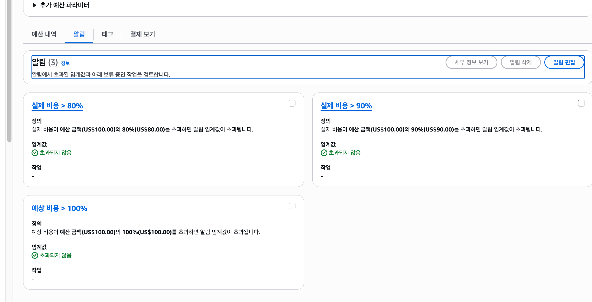
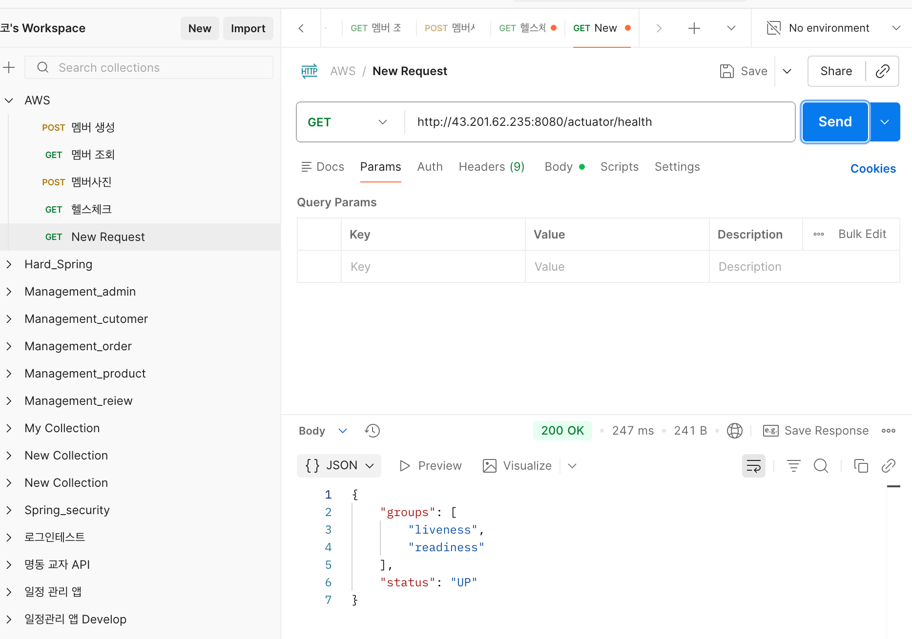
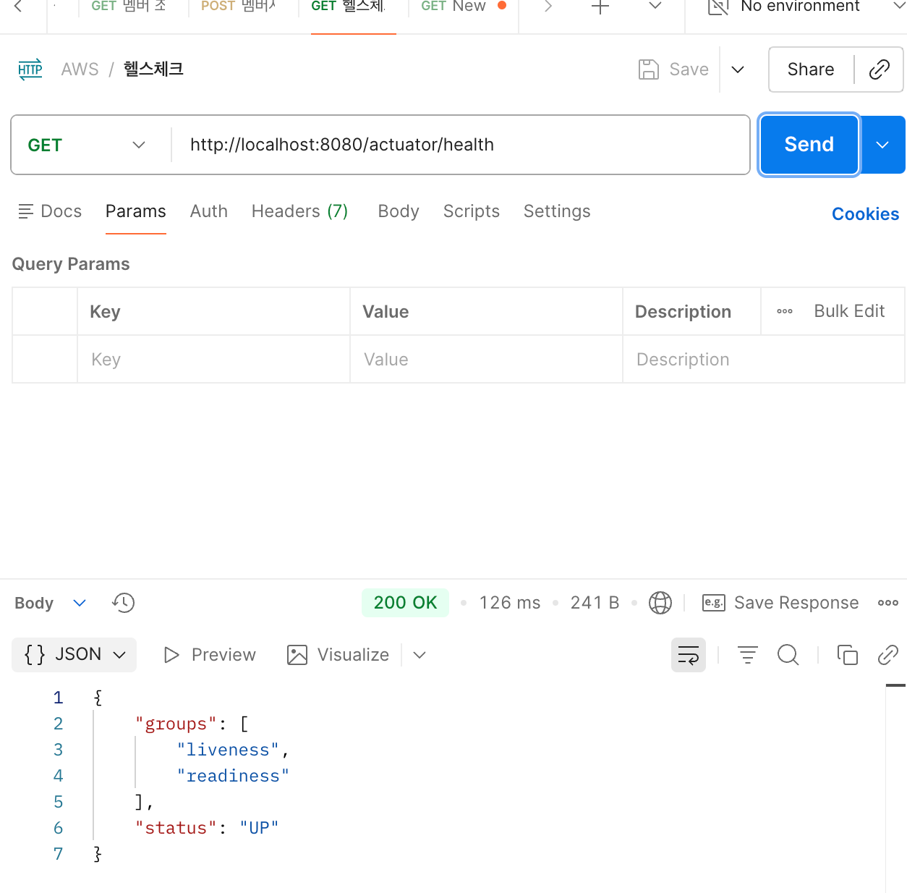
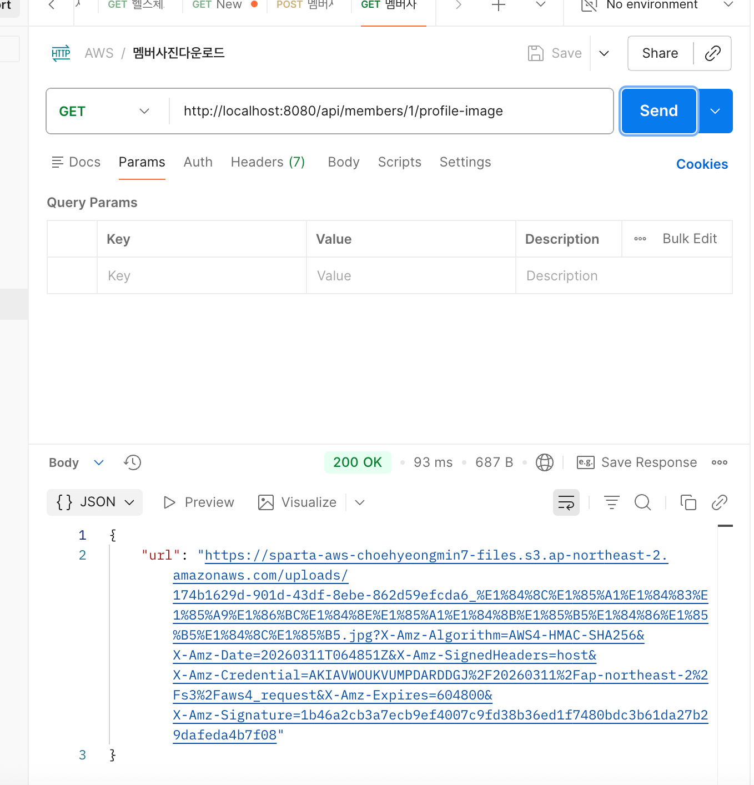
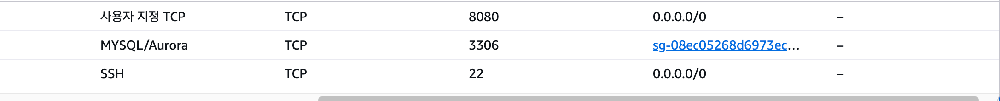
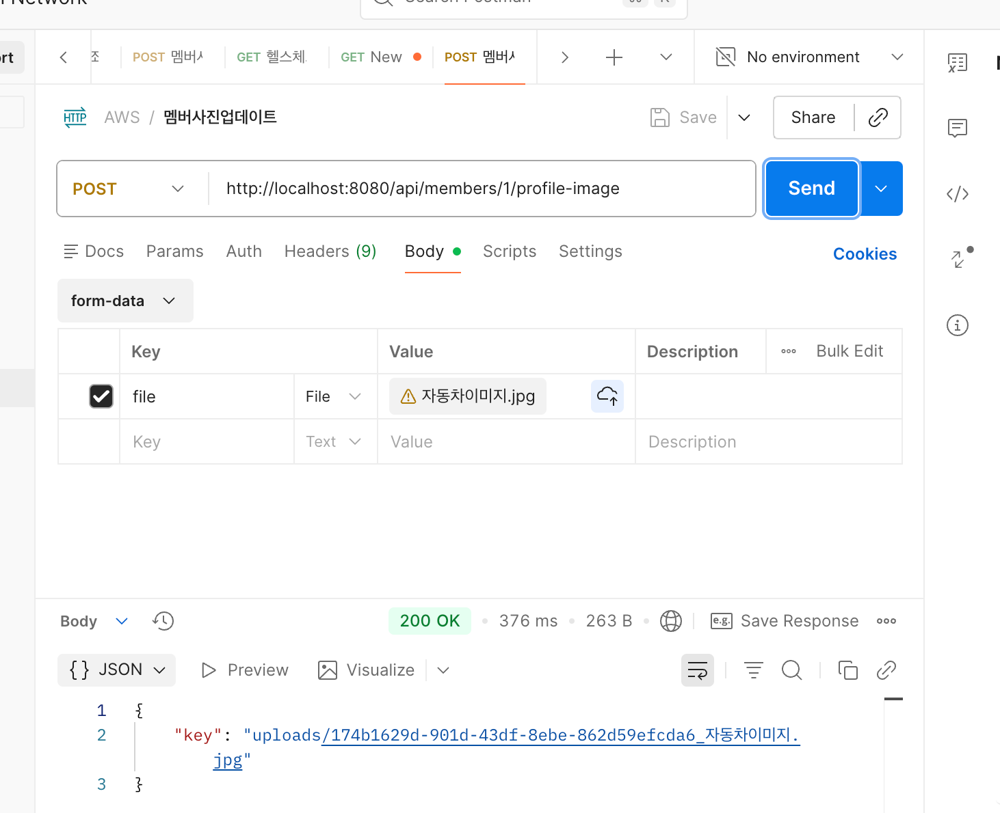
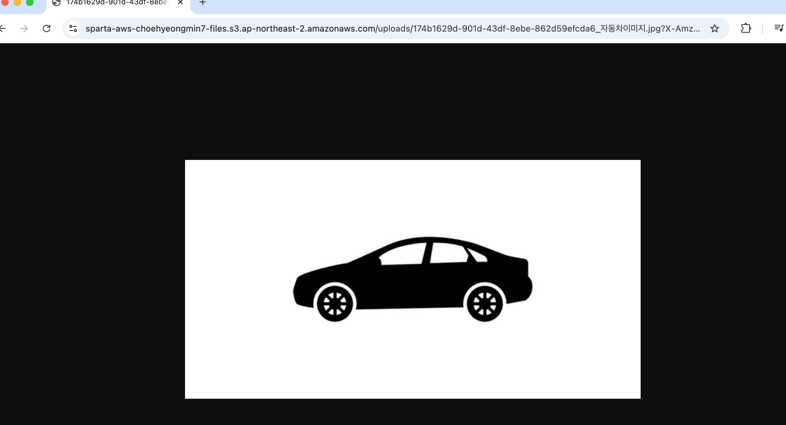
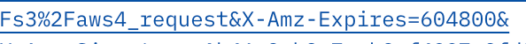

## LV 0 - 요금 폭탄 방지 AWS Budget 설정
AWS Budgets

## LV 1 - 네트워크 구축 및 핵심 기능 배포

## LV 2 - DB 분리 및 보안 연결하기
1. Actuator Info 엔드포인트 URL

2. RDS 보안 그룹 스크린샷

   
## LV 3 - 프로필 사진 기능 추가와 권한 관리
1. POST /api/members/{id}/profile-image

2. GET /api/members/{id}/profile-image

3. 해당 자동차 이미지.

4. 7일

### 2026 03.10 19:12
- 필수 레벨 Lv 1 완료.
- 필수 레벨 Lv 2 진행 중.

### 2026 03.10 20:36
-필수 레벨 Lv 2 완료.

### 2026 03.11 16.03
-필수 레벨 Lv 3 완료
-필수 레벨 이미지 자료 RREADME에 저장.

### 2026 03.11 17.30
-README 수정.

