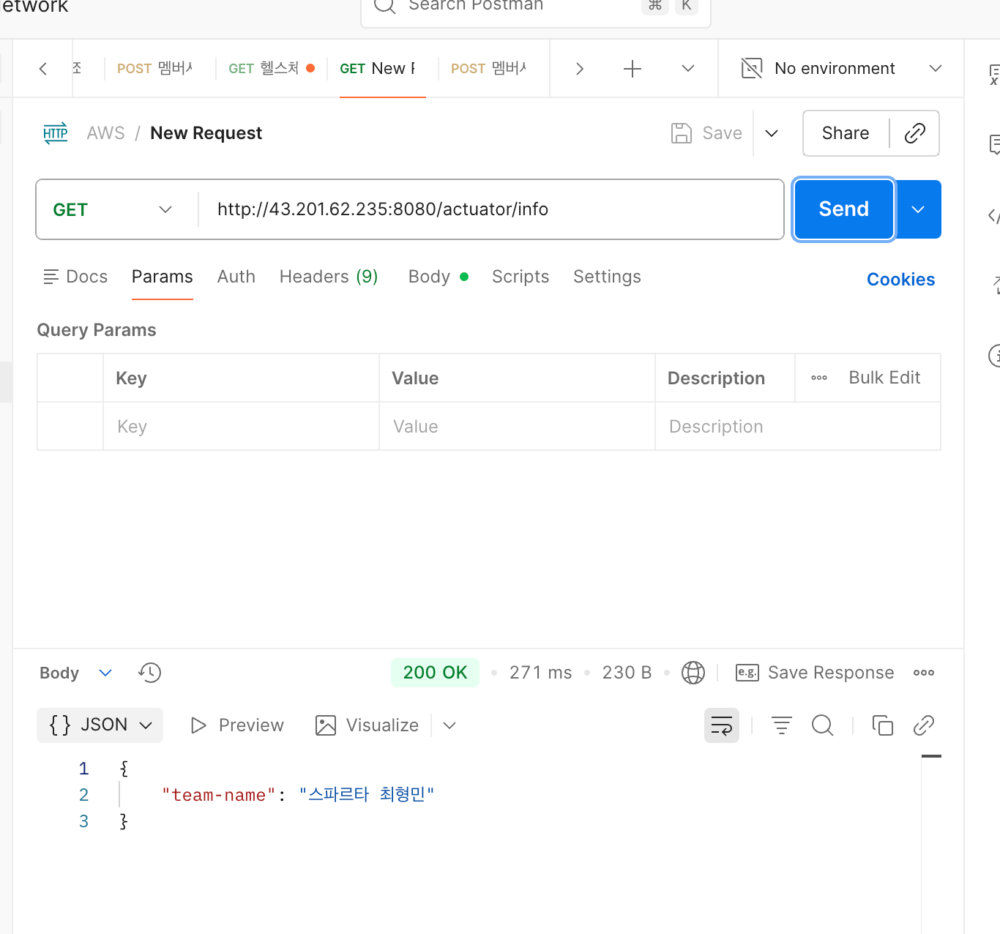
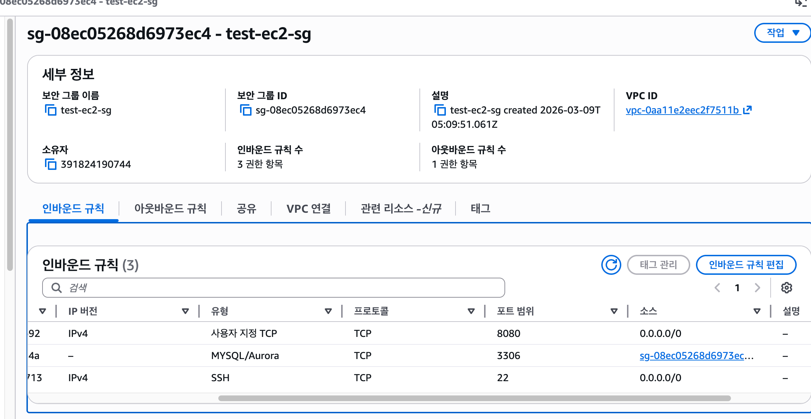
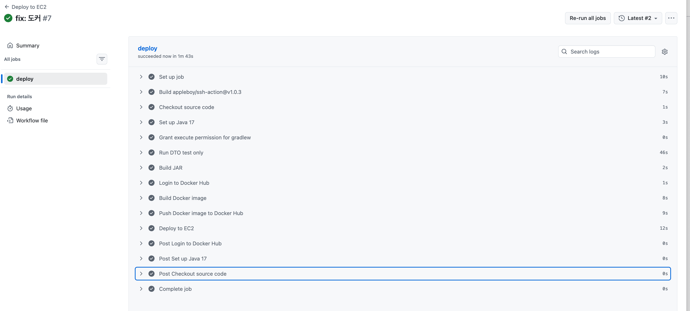
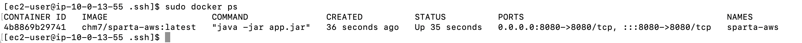

# 과제 이미지 

## LV 0 - 요금 폭탄 방지 AWS Budget 설정
### AWS Budgets
- 

## LV 1 - 네트워크 구축 및 핵심 기능 배포

## LV 2 - DB 분리 및 보안 연결하기
### 1. Actuator Info 엔드포인트 URL

### 2. RDS 보안 그룹 스크린샷

   
## LV 3 - 프로필 사진 기능 추가와 권한 관리
### 1. POST /api/members/{id}/profile-image

### 2. GET /api/members/{id}/profile-image

### 3. 해당 자동차 이미지.

### 4. 7일

## LV 4 - Docker & CI/CD 파이프라인 구축
### Github Actions 성공 이미지

### EC2 터미널 이미지

# 구현 일정 

### 2026 03.10 19:12
**구현 기능**
- 필수 레벨 Lv 1 완료.
- 필수 레벨 Lv 2 진행 중.

### 2026 03.10 20:36
**구현 기능**
- 필수 레벨 Lv 2 완료.

### 2026 03.11 16:03
**구현 기능**
- 필수 레벨 Lv 3 완료
- 필수 레벨 이미지 자료 RREADME에 저장.

### 2026 03.11 17:30
**구현 기능**
- README 수정.

### 2026 03.11 20:30
**구현 기능**
- 도전 Lv 4 진행중.

**특이사항**
- 도커 CI를 위해서 간단한 테스트코드 작성 완료.

### 2026 03.12 19:06
**구현 기능**
- 도전 Lv 4 완료
  
**특이사항**
- workflow 코드에 변수명을 잘못 기입한 문제를 뒤 늦게 깨달아서 오류를 수정하는데 4시간을 소요 했다. 
git Action Screts에 EC2_USER라고 설정하고, workflow에는 EC2_USERNAME이라고 했었다.
